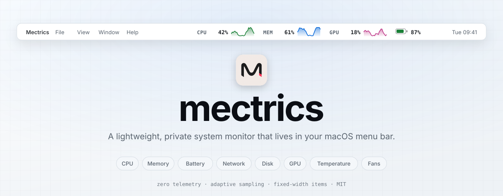
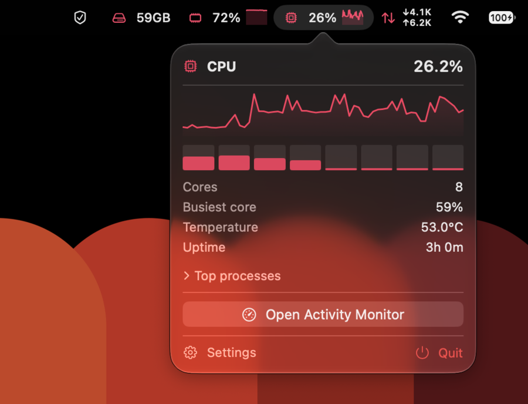
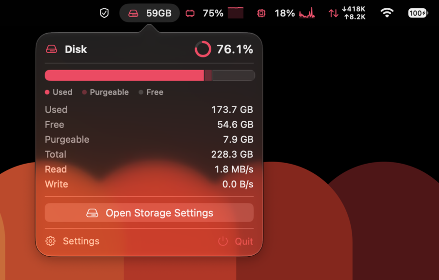
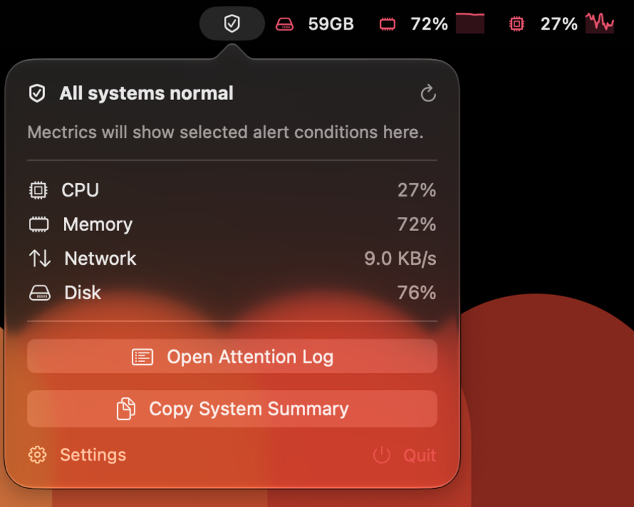
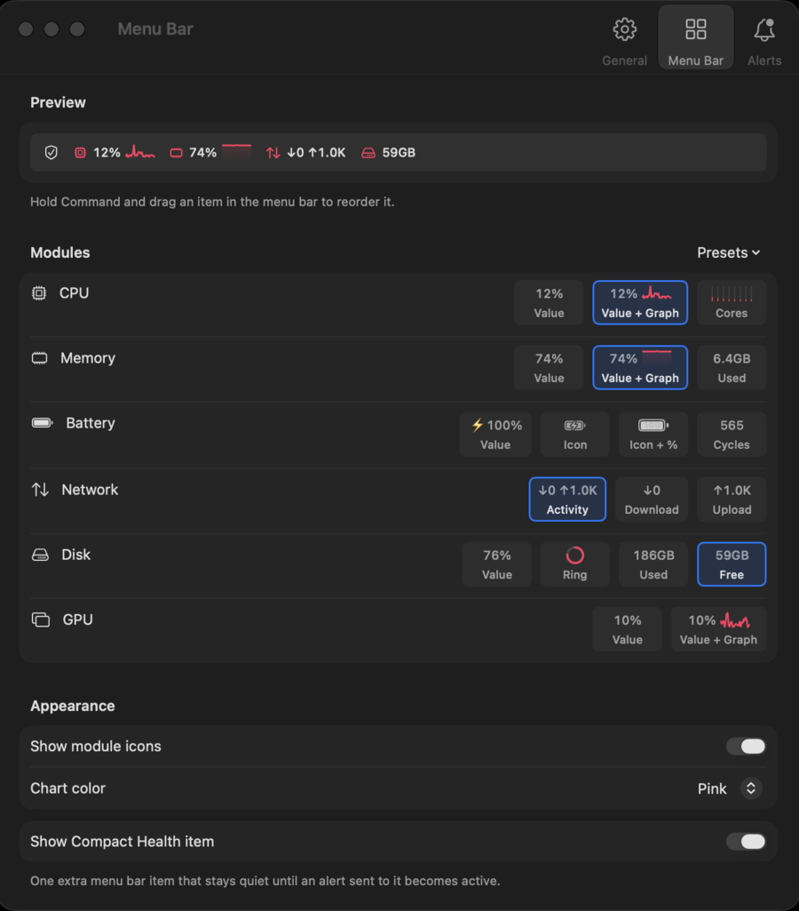
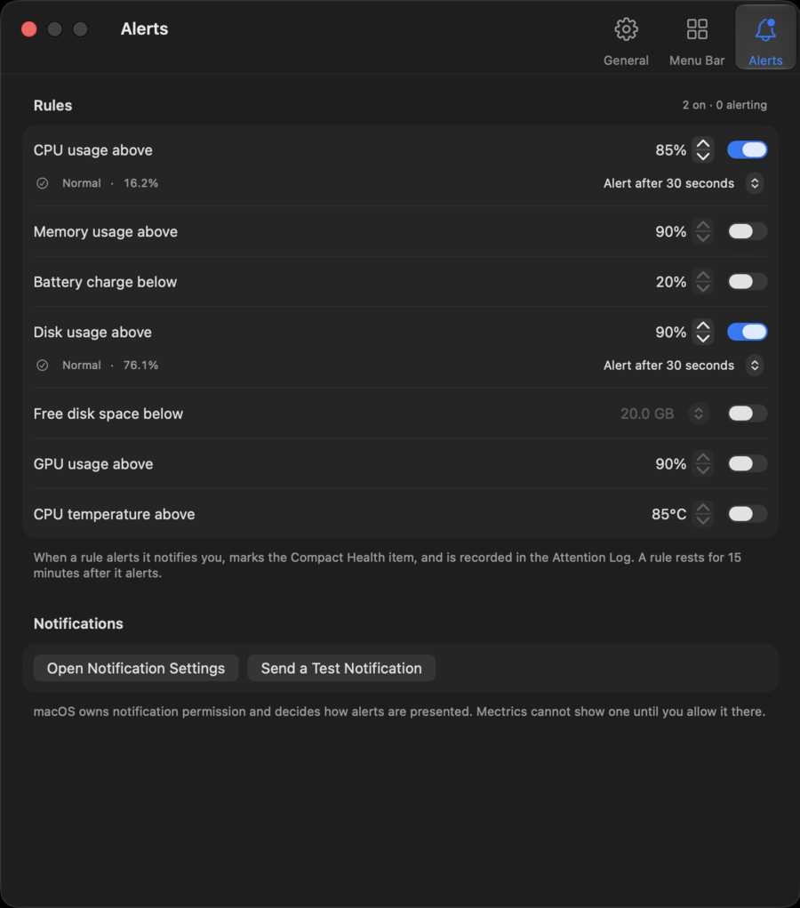

<div align="center">

<picture>
  <source media="(prefers-color-scheme: dark)" srcset="docs/assets/banner-dark.svg">
  <source media="(prefers-color-scheme: light)" srcset="docs/assets/banner-light.svg">
  
</picture>

<p>
  
  
  <a href="LICENSE"></a>
  <a href="https://github.com/sponsors/farukkamcici"></a>
  <a href="https://github.com/farukkamcici/mectrics/releases"></a>
  <a href="https://github.com/farukkamcici/mectrics/actions/workflows/ci.yml"></a>
  
</p>

<p><b>CPU · Memory · Battery · Network · Disk · GPU · Temperature · Fans</b><br>
live in your menu bar — readable at a glance, and the bar never jumps around.</p>

<p><a href="https://mectrics.app"><b>mectrics.app</b></a></p>

<a href="https://www.producthunt.com/products/mectrics?embed=true&amp;utm_source=badge-featured&amp;utm_medium=badge&amp;utm_campaign=badge-mectrics" target="_blank" rel="noopener noreferrer"></a>

</div>

---

## What it is

**mectrics** is a native macOS menu bar system monitor. Each module you enable draws a
readable value — with a live sparkline where a trend actually tells you something — and
stays out of the way otherwise. A click opens a detail popover with the numbers behind it.
An optional **Compact Health** item collapses the whole machine into a single indicator
that speaks up only when something needs attention.

It is built around three commitments:

| | |
|---|---|
| 🔒 **Private by construction** | Zero telemetry. No analytics, no identifiers, no crash reports. The only network request the app can make is an update check you trigger yourself — automatic checks are off by default. |
| 🪶 **Light on the machine** | About **27 MB** of memory and **a few percent of one CPU core** while it sits in your menu bar — the same memory number Activity Monitor shows you. Sampling slows down on battery and backs off in Low Power Mode and when your Mac runs hot. |
| 📐 **Stable in the menu bar** | Items reserve a fixed width, so values change without anything shifting sideways. |

Those numbers come from half-hour runs of the shipping build, not from one glance at
Activity Monitor, and they are checked before a release rather than assumed. What you see
will differ with your Mac, how many items you put in the menu bar, and whether you are on
battery — more items means more work, because each one redraws every second.

The project holds itself to deliberately tight internal budgets — 60 MB of memory and 3% of
a core — and publishes where it stands against them rather than only the flattering half.
Memory is comfortably inside; CPU currently sits just above. The
[measurements and the reasoning](docs/architecture.md#power-and-performance) are written
down, and so is [how to run them yourself](CONTRIBUTING.md#performance-validation).

<div align="center">
  <a href="https://github.com/farukkamcici/mectrics/releases/latest/download/Mectrics.dmg"><b>⬇︎ Download Mectrics 1.5.0</b></a><br>
  <sub>macOS 15+ · signed and notarized · 5.4 MB</sub>
</div>

## Modules

<div align="center">
  
</div>

Unavailable hardware hides itself — no Fans module on a fanless MacBook Air, no Battery on
a Mac mini. **A missing reading shows a dash, never a fabricated `0`.**

| Module | What you can put in the menu bar | Sparkline |
|---|---|---|
| **CPU** | Usage %, per-core bars, temperature | ✅ |
| **Memory** | Usage %, used memory, temperature | ✅ |
| **GPU** | Utilization %, temperature | ✅ |
| **Battery** | Level with charge indicator, icon, health, cycles | — |
| **Network** | Stacked ↓/↑ activity, download only, upload only | — |
| **Disk** | Usage %, ring, used, free | — |
| **Fans** | Fastest fan RPM | — |

Sparklines are drawn for the three metrics where a trend is genuinely informative. The rest
show a value, because a chart of your disk's fill level is decoration.

A module can contribute **several independent items** — Battery can show its icon *and* its
health side by side. You pick components by clicking a live preview chip in the menu bar
builder, so you choose from what you can actually see. Each popover adds the detail behind
the value: per-core load and top processes for CPU, swap and pressure for Memory,
hardware temperature for CPU, Memory, and GPU when the Mac reports it, read/write
throughput for Disk, and so on.

<table>
<tr>
<td width="50%" valign="top">
  
  <p align="center"><sub><b>CPU</b> — a bar per core, and the top processes behind the disclosure</sub></p>
</td>
<td width="50%" valign="top">
  
  <p align="center"><sub><b>Disk</b> — capacity split three ways, plus live throughput</sub></p>
</td>
</tr>
</table>

## Beyond the numbers

- **Compact Health** — one status item that summarizes the whole machine and surfaces only
  what is off, including the two conditions macOS reports itself.
- **Alert rules** — sustained notifications with a live preview and test delivery, so you
  know what a rule will look like before it fires at 3am. Rules watch either a number you
  pick or a state macOS reports: your Mac slowing its CPU and GPU down to cool off, and
  the kernel's own memory pressure. A hot sensor is not the same thing as a machine that
  has actually been slowed, and memory can be nearly full with nothing wrong.
- **Attention Log** — a local, exportable record of what tripped and when.
- **Energy Guard** — sampling that steps down under Low Power Mode and thermal pressure.
- **Menu bar builder** — a visual layout editor with presets, where you toggle components
  by clicking their live preview instead of guessing from a list.
- **Widgets** — small / medium / large WidgetKit overviews for Notification Center.
- **Diagnostics** — a local-only system summary you can copy or export as plain text.
- **Headless CLI** — a read-only automation interface for alert events and one-shot health
  checks on Macs whose menu bar is not visible.
- **Three-step onboarding**, accent themes, and launch at login.

<div align="center">
  
  <p><sub><b>Compact Health</b> — the whole machine in one item, quiet until it is not</sub></p>
</div>

<table>
<tr>
<td width="50%" valign="top">
  
  <p align="center"><sub><b>Menu bar builder</b> — click a live chip to add or remove it</sub></p>
</td>
<td width="50%" valign="top">
  
  <p align="center"><sub><b>Alert rules</b> — with the current reading next to each threshold</sub></p>
</td>
</tr>
</table>

## Install

Requires **macOS 15 (Sequoia)** or newer.

[**Download Mectrics.dmg**](https://github.com/farukkamcici/mectrics/releases/latest/download/Mectrics.dmg)
from the [latest release](https://github.com/farukkamcici/mectrics/releases/latest), open it,
and drag Mectrics to Applications. The app is signed with a Developer ID and notarized by
Apple, so it opens without a Gatekeeper detour.

Mectrics has no Dock icon and no window — after launching, look for it in the menu bar.

Updates are checked only when you ask, under **Settings → General → Check for Updates…**.

The interface is available in English, Turkish, Russian, Spanish, French, and Brazilian
Portuguese. Choose **Settings → General → Language**, then relaunch Mectrics when prompted.

### Headless automation

The app bundle includes a read-only `mectrics` CLI for Macs whose menu bar is not visible.
The app remains the place where alert rules are configured. The CLI reads those rules and
exposes them to scripts and agents without changing any settings.

Choose **Settings → Alerts → Install CLI…** once to make `mectrics` available in every
Terminal. This creates a symbolic link at `/usr/local/bin/mectrics`; it does not download
another executable or install a background service. macOS may ask for administrator
permission.

Check the enabled rules without parsing output:

```bash
mectrics check
```

`check` exits with `0` when every current reading is within its limit, `1` when at least
one limit is crossed, and `2` when no rules are configured or the result cannot be
determined because a reading is unavailable. Add `--json` when details are needed:

```bash
mectrics check --json
```

Take a one-shot snapshot of every available module:

```bash
mectrics snapshot --json
```

The snapshot includes each module's primary value, unit, timestamp, and detail fields;
unsupported hardware is listed as unavailable rather than reported as zero. Stream actual
alert activation and recovery events as newline-delimited JSON with:

```bash
mectrics alerts watch --json
```

`watch` does not print an initial snapshot. It waits quietly until a rule activates or
recovers, then writes that event to the Terminal as one JSON line. Use `check --json` when
the current state is needed immediately.

For a supervised, long-running stream, add a heartbeat interval:

```bash
mectrics alerts watch --json --heartbeat 60
```

Heartbeat mode uses tagged NDJSON records. It writes a `ready` record immediately, periodic
`heartbeat` records, `alert` records for activation and recovery, and `status` records when
sampling coverage becomes degraded or recovers. Each heartbeat includes the latest sample
time and any unavailable conditions or stale metrics, so a consumer can distinguish a quiet
Mac from a live process whose sensor sampling has stopped. Without `--heartbeat`, the original
version 1 alert-event JSON remains unchanged.

A known crossed limit takes priority over an unavailable reading. `check` is immediate, so
a crossed limit means the corresponding sustained rule would enter its pending state now;
`alerts watch` remains the source for actual activation and recovery events.

JSON output goes to standard output. Startup information and errors go to standard error,
so pipes stay machine-readable. The CLI samples only the metrics needed for the requested
operation and makes no network requests. It does not include the app's live dashboard,
settings, widgets, or history.

Invalid commands and flags exit with `64`; corrupt saved configuration exits with `78`; an
internal output failure exits with `70`. These are separate from `check`'s `0` / `1` / `2`
health result. Run `mectrics doctor` (or `mectrics doctor --json`) to validate the executable,
saved rules, available alert coverage, installed command link, and current power source.

Run the CLI as the same macOS user who configured Mectrics. A root-owned cron job reads root's
preferences instead. Cron also commonly has a restricted `PATH`, so use
`/usr/local/bin/mectrics check` or set `PATH` explicitly. `check` is the command for cron and
other one-shot probes; `alerts watch` is a persistent stream and should be run under a process
supervisor rather than launched repeatedly by cron. A watch session takes a snapshot of the
enabled rules when it starts, so restart it after changing rules in the app.

### Uninstall

Dragging Mectrics to the Trash removes the app but not its settings — macOS keeps those
for every app, which is why a reinstall goes straight back to your old layout instead of
showing onboarding again. For a clean removal, choose **Settings → General → Uninstall…**.
Mectrics unregisters its login item, quits, then removes the app, its settings, alert rules,
Attention Log, caches, and its optional `/usr/local/bin/mectrics` link. macOS may ask for
administrator permission when that link is present.

macOS may retain the widget's protected cached snapshot after removal; it reclaims that
container once the extension is gone. If Mectrics cannot be opened, use the manual
uninstall script instead:

```bash
curl -fsSL -o /tmp/mectrics-uninstall.sh https://raw.githubusercontent.com/farukkamcici/mectrics/main/scripts/uninstall.sh
zsh /tmp/mectrics-uninstall.sh
```

It lists what it will delete and asks before touching anything.

### Build from source

```bash
git clone https://github.com/farukkamcici/mectrics.git
cd mectrics
brew install xcodegen
xcodegen generate
open Mectrics.xcodeproj      # then ⌘R
```

Full setup notes, including code signing, are in [`CONTRIBUTING.md`](CONTRIBUTING.md).

## Privacy

Zero telemetry — not "anonymized", not "opt-out". No usage data, hardware information,
metric history, or alert configuration ever leaves the device. Every number comes from a
local, read-only system interface.

The single network request the app can make is an update check, and only when you choose
**Check for Updates…**. Read the full statement in [`PRIVACY.md`](PRIVACY.md).

## Non-goals

Knowing what a project will not do is what keeps it small enough to trust. Mectrics reads
the machine it runs on and reports what it finds. Everything below is out of scope, and an
issue asking for one of them will be closed with a link here rather than a debate.

- **Telemetry of any kind**, including anonymous, aggregated, or opt-in. There is no
  version of this that gets built.
- **Accounts, cloud sync, or a companion service.** Nothing here needs a server, so
  nothing here will grow one.
- **Anything outside the machine.** Remote hosts, SaaS quotas, API usage, container fleets:
  all reasonable things to monitor, none of them this app's job.
- **Acting on what it finds.** Mectrics does not kill processes, purge caches, or change
  system settings. It shows you the number and hands you off to the tool that owns the
  action, which is why the popovers open Activity Monitor and System Settings instead of
  reimplementing them.
- **Benchmarking or stress testing.** Reading a load is not the same as creating one.
- **Other platforms.** macOS only. No iOS companion, no Linux port.
- **A window.** The menu bar is the interface. There is no Dock icon and no main window,
  and that is a design decision rather than a missing feature.

Forks are welcome to disagree with every line of this. That is what the MIT license is for.

## Contributing

Contributions are welcome — new hardware coverage and translations especially.

If Mectrics is useful to you, you can [support its ongoing development through GitHub
Sponsors](https://github.com/sponsors/farukkamcici).

- [`CONTRIBUTING.md`](CONTRIBUTING.md) — setup, the development loop, how to add a metric
  provider or a translation
- [`AGENTS.md`](AGENTS.md) — the conventions this repository enforces, and the source of
  truth for them
- [`docs/architecture.md`](docs/architecture.md) — how the app and the metric engine fit
  together, and where each number comes from

The translation workflow is documented in [`CONTRIBUTING.md`](CONTRIBUTING.md).

## Security

Found a vulnerability? Please report it privately — see [`SECURITY.md`](SECURITY.md).

## Acknowledgements

Prior art that set the bar: [Stats](https://github.com/exelban/stats) for proving an open
source monitor can be excellent, and iStat Menus for the depth people expect. Built with
[Sparkle](https://github.com/sparkle-project/Sparkle) for updates and
[XcodeGen](https://github.com/yonaskolb/XcodeGen) for a reviewable project file.

## License

[MIT](LICENSE) © Faruk Kamçıcı
