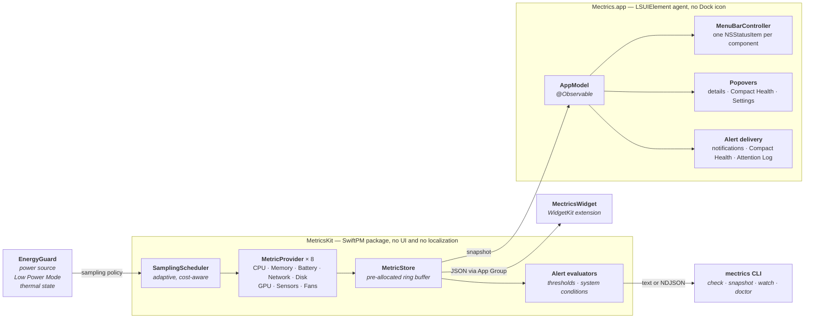

# Architecture

How mectrics is put together and why. This assumes general application experience rather
than familiarity with AppKit, IOKit, or the SMC.

## The split

The metric engine is a UI-independent Swift package. Everything that touches the machine
lives there; everything that touches the screen lives in the app target. That is what makes
the engine testable, keeps a misbehaving provider away from the UI, and lets the widget
extension read the same data.



## Technology choices

| Layer | Choice | Why |
|-------|--------|-----|
| Language | **Swift 6** (MetricsKit builds in the Swift 6 language mode) | Native, low resource use; strict concurrency checks the queue boundaries the engine crosses. |
| UI | **SwiftUI + AppKit hybrid** | SwiftUI for settings, popovers, and windows. AppKit (`NSStatusItem`) for the menu bar — pure SwiftUI `MenuBarExtra` cannot do the custom drawing a live sparkline needs. |
| Menu bar | **`NSStatusItem` + rendered `NSImage`** | Live text and sparkline, ⌘-drag reordering, pixel-precise width control. |
| Widget | **WidgetKit** extension | System-native but throttled to minutes; the menu bar covers the real-time need. |
| Metric engine | **Local Swift package `MetricsKit`** | Testable, UI-independent, shared with the widget extension. |
| Sharing | **App Group container** | Main app ↔ widget extension data hand-off. |
| Reactivity | **`@Observable`** | sampler → store → app model → UI. |
| Persistence | **UserDefaults (App Group)** + a small JSON snapshot | Settings plus the widget's last snapshot. No database needed. |
| Updates | **Sparkle** | The standard for directly distributed macOS apps. |
| Login item | **`SMAppService`** | The modern launch-at-login API. |

**Minimum target:** macOS 15 Sequoia, on Apple silicon and Intel. Modern APIs
(`@Observable`, current WidgetKit) are therefore freely usable. Intel support is not a
separate code path — it lives in the providers, which read whichever SMC key family and
accelerator driver the machine happens to expose.

## MetricsKit

```swift
// A single measurement.
struct MetricSample {
    let timestamp: Date
    let value: Double            // normalized base value (e.g. CPU load as a fraction)
    let detail: [String: Double] // per-core, used/wired, up/down, and so on
}

protocol MetricProvider: AnyObject, Sendable {
    var id: MetricID { get }         // .cpu, .memory, ...
    var isAvailable: Bool { get }    // hardware and permission present?
    var cost: SamplingCost { get }   // light / medium / heavy → scheduling weight
    func sample() -> MetricSample?
}

final class MetricStore {
    // A fixed-size ring buffer per metric, pre-allocated.
    func append(_ sample: MetricSample, for id: MetricID)
    func latest(_ id: MetricID) -> MetricSample?
    func history(_ id: MetricID, count: Int) -> [MetricSample]   // sparklines
}
```

Providers are sampled on a single serial queue, which is why `MetricProvider` requires
`Sendable` and the concrete providers are `@unchecked Sendable`: they wrap C-based
Mach/IOKit state and own their synchronization. Anything read outside that queue must be
guarded by a lock.

A provider that returns `isAvailable = false` is filtered out at registration, so its module
disappears from the UI rather than showing an empty row.

### Where the numbers come from

| Metric | Source | Pitfall |
|--------|--------|---------|
| CPU | `host_processor_info(PROCESSOR_CPU_LOAD_INFO)` | Usage is the difference between two consecutive samples; per-core comes from the same call. |
| Memory | `host_statistics64(vm_statistics64)` + `sysctl(hw.memsize)` | Pressure and compressed pages are separate from plain "used". |
| Battery | IOKit `IOPSCopyPowerSourcesInfo`; health and cycles from `IORegistry AppleSmartBattery` | Two different sources feed one module. |
| Network | `sysctl(NET_RT_IFLIST2)` + `if_data64` | Δbytes/Δt. 64-bit counters are required — 32-bit ones wrap on a long uptime. Loopback is filtered by `IFF_LOOPBACK`. |
| Disk space | `statfs`, plus `URL.resourceValues` for reclaimable space | `statfs` every sample; the reclaimable figure goes through the cache-deletion daemon and is refreshed once a minute. |
| Disk throughput | IOKit `IOBlockStorageDriver` statistics | Δ read/write bytes. |
| GPU | IOKit accelerator "Device Utilization %"; VRAM via IORegistry | Keys differ across Apple Silicon generations. |
| Temperature | SMC key reads grouped into CPU, GPU, and Memory hardware domains | The SMC key set differs per machine — treat every key as optional. |
| Fans | SMC `FNum` and `F*Ac` keys | Some Macs have no fans at all; speed keys provide a fallback when the count key is unavailable. |

All of these are read-only. Reading sensors, SMC, fans, and GPU is restricted under the App
Store sandbox, which is why full functionality requires direct distribution with a Developer
ID and notarization.

### Where the system's own verdicts come from

Four alert conditions are not thresholds on a sampled number but states macOS reports
directly. `SystemConditionSource` resolves all four from one sampling pass, so the app, the
CLI, and the one-shot health report read them identically.

| Condition | Source | Why it is not a number rule |
|-----------|--------|-----------------------------|
| Thermal pressure | `ProcessInfo.thermalState` | A temperature says how hot a part is; this says whether the machine is being slowed down. On Apple silicon the state covers the whole package, so a throttled GPU is included — there is no separate public GPU signal, and reading clock frequencies would mean private interfaces (`IOReport`) that put notarization at risk. |
| Memory pressure | `sysctl(kern.memorystatus_vm_pressure_level)` | Memory can sit at 95% used with the kernel under no pressure at all. The percentage cannot tell a healthy full machine from a struggling one. |
| Disk capacity | `statfs` free bytes, via the disk provider's detail | Free space is already the right signal; there is nothing for macOS to judge. |
| Battery service | IOKit's service-recommended flag | A hardware fault macOS has decided on, not a reading to compare. |

Thermal pressure is the only one with no provider behind it, so it stays readable when a
sampling cycle turns up nothing. Its rule is filed under the CPU module for grouping and
for opening the right detail window; its wording names the GPU as well.

Both state conditions run through the same sustained-duration and cooldown machinery as the
number rules (`SystemConditionMonitor`): a state has to persist for the rule's window before
it alerts, because a build that pushes the chip into throttling for twenty seconds is
ordinary work, not news. `EnergyGuard` reads the same thermal enum it uses to slow its own
sampling, so Mectrics eases off on exactly the states it would report.

## Menu bar rendering

- One `NSStatusItem` per enabled **component**, not per module — Battery can contribute its
  icon and its health as two independent items.
- CPU, Memory, and GPU can each contribute an independent temperature item when the Mac
  reports a recognized sensor for that hardware domain.
- Each item renders text plus an optional sparkline into an `NSImage` assigned to the button.
  This avoids subview layout, is pixel-precise, and adapts correctly to light and dark.
- **Width stability is a hard rule.** Each component reserves a fixed text width from a
  worst-case template (`MenuBarComponent.template(for:)`) and right-aligns monospaced digits
  inside it. An item must never change width because a value gained a digit. Digits are
  monospaced but unit letters are not, so a template is sized for the widest *letter* a
  formatter can emit — `MenuBarTemplateTests` checks every component against its real
  formatter output rather than leaving the rule to a draw-time assertion.
- Redraw is skipped when an item's render inputs are unchanged: handing AppKit an image
  invalidates the status item and round trips to the window server, which costs far more
  than drawing it did. Reducing work when nobody can see the menu bar happens a layer
  lower, in Energy Guard's sampling policy.
- ⌘-drag reordering is native; `NSStatusItem.autosaveName` preserves position.

## Windows and the Dock

Mectrics is an `LSUIElement` agent: it launches with no Dock icon and no main window. It
becomes a regular application only while one of its own standard windows is on screen —
Settings, the Attention Log, Diagnostics, a metric detail, About, What's New, onboarding —
and drops back to `.accessory` when the last of them closes.

[`DockPresence`](../Mectrics/App/DockPresence.swift) owns that decision and every window
controller reports to it. The question cannot be answered from `NSApplication.windows`:
that collection also holds the window behind each status item, which is visible for the
whole life of the app, so "any visible window" is permanently true and the icon never goes
away once shown. Close ordering is a second trap — `windowWillClose` runs before the window
stops being visible — so the policy is applied one run-loop turn later, after AppKit has
finished. Because the decision is a plain object rather than an AppKit query, it is unit
tested, including a real window that is genuinely closed.

Settings drops its window on close rather than keeping it for the session. It is the app's
heaviest surface — a SwiftUI window's working set is most of the footprint a menu bar agent
is budgeted for, about 35 MB on the reference Mac — and the selected pane and frame are
restored from preferences when it opens again.

What's New is keyed by version. `ReleaseHighlights` maps a marketing version to the two or
three things worth telling someone about, and the window shows the running build's entry;
before that it was one hardcoded list, so every upgrade was greeted with news from an older
release. A version with no entry presents nothing rather than something stale, and a test
fails if the current version has no notes.

## Compact Health

The always-on-top floating panel that once existed was removed: it duplicated the menu bar
without answering a question the menu bar could not, and it dragged along per-display
placement, a global hotkey, and two layout modes.

The optional **Compact Health** item replaced it — a single stable-width status item that
stays quiet and turns into a warning only when an alert routed to it activates. Real-time
viewing therefore lives entirely in the menu bar and its popovers, and no second
always-visible surface should be reintroduced.

The bundled `mectrics` CLI is a read-only automation interface for unattended machines,
not another dashboard. The app owns configuration. The CLI reads its enabled rules and can:

- wait for actual activation and recovery transitions, then print each new event as text
  or newline-delimited JSON without emitting an initial snapshot;
- list the effective rules in a stable, versioned JSON envelope;
- compare one fresh set of readings with the configured limits through `mectrics check`
  and return a script-friendly exit code;
- capture every available module once through `mectrics snapshot`, including the full
  detail dictionary in its versioned JSON output.

The one-shot check deliberately reports `limitCrossed`, not `active`: it does not wait for
a rule's sustained duration. Exit code `0` means healthy, `1` means at least one current
limit is crossed, and `2` means unconfigured or indeterminate because a reading is
unavailable. A known crossed limit takes priority over an unavailable reading. Both the app
and CLI use the same UI-independent alert models and evaluators from MetricsKit.

Process and health failures occupy separate exit-code namespaces. Invalid syntax uses
`EX_USAGE` (`64`), an internal serialization failure uses `EX_SOFTWARE` (`70`), and corrupt
saved rules use `EX_CONFIG` (`78`). The published health meanings of `0`, `1`, and `2` do not
change. Normal machine-readable data is written only to standard output; startup and
diagnostic messages use standard error.

The default JSON watch stream remains version 1 activation and recovery events. Opting into
`--heartbeat` switches to a tagged stream with `ready`, `heartbeat`, `alert`, and `status`
records. Heartbeats report both process liveness and data freshness. The watch consumes full
sampling-cycle reports: a failed provider never advances an alert from a cached reading, three
consecutive failures degrade coverage, and a reading older than the shared stale interval is
reported as stale. Coverage recovery is also emitted. Provider-backed and native conditions
are scheduled separately, so thermal pressure is read directly from `ProcessInfo` without
constructing or sampling a CPU provider.

The CLI constructs providers lazily from the enabled rules instead of initializing every
hardware source and filtering afterward. Long-running watch sampling follows the current AC
or battery interval and notices power-source changes. A watch session intentionally freezes
its rule configuration at startup; changing rules in the app requires restarting the session.
This keeps incident state transitions deterministic and is stated in the public help.

The executable remains inside the signed app bundle. The optional **Install CLI…** action
creates `/usr/local/bin/mectrics` as a symbolic link to that executable, so app updates also
update the command. It downloads no second binary and installs no background service. The
installer refuses to overwrite an unrelated command at that path, and app removal also
removes a link that belongs to Mectrics.

The internal `metricskit-demo` executable is separate. It renders every provider in a live
terminal view for development and hardware validation, is available only through SwiftPM,
and is not embedded in `Mectrics.app`.

## Widget

`TimelineProvider` reads the last snapshot from the App Group container. The main app
periodically writes that snapshot plus a short history and calls
`WidgetCenter.shared.reloadTimelines`. The system throttles widget refreshes to minutes, so
the widget is positioned as "at a glance" while the menu bar carries the real-time job.

## Power and performance

- **Adaptive sampling** — faster on AC, slower on battery, paused when the work is not
  visible.
- **Energy Guard** moves the engine between normal, reduced, and protected modes based on
  power source, Low Power Mode, thermal pressure, and whether anyone can currently see the
  menu bar — a sleeping display, a locked screen, and a switched-away session all count as
  asleep.
- Cost classes are the scheduler's dial: `.light` runs on every base cycle, `.medium`
  (battery, disk) and `.heavy` (SMC, GPU, sensors) are thinned by the intervals in
  `SamplingRuntimePolicy`, which Energy Guard widens as conditions tighten. Battery and
  disk are read every second base cycle even in normal mode: both move on the scale of
  minutes and each costs an IOKit round trip.
- What is on screen decides which providers run at all, not only how often. The SMC is
  sampled only where a temperature is actually shown — a `.temperature` menu bar
  component, an open popover or detail window for CPU/Memory/GPU, the menu bar builder,
  or a rule that watches the CPU temperature directly.
- The hot path is allocation-free: the ring buffer is pre-allocated.
- Providers copy the single IORegistry property they need rather than a whole property
  dictionary, and anything that reaches a system daemon (reclaimable disk space) runs on
  its own slow cadence.
- Targets: under 60 MB memory, low and steady CPU, "Energy Impact: Low" in Activity
  Monitor. Memory means `phys_footprint` — what Activity Monitor's "Memory" column
  reports — and not `ps rss`, which counts shared framework pages every SwiftUI app maps
  and reads about three times higher. A Release build with the default four menu bar items
  measures a 27 MB `phys_footprint` p95 over a 31-minute run; the same build with the
  Settings window left open measures 62 MB, because a SwiftUI window's working set is most
  of that figure. The 60 MB budget
  describes the menu bar's steady state, which is what the app spends its life in.
- Local points-of-interest signposts cover provider discovery, menu bar readiness, engine
  start, the first live sample, and popover presentation. They are visible to
  Instruments but are neither persisted nor transmitted.
- `scripts/performance/measure.sh` launches an isolated Release app or attaches to an
  explicit PID, records time-series CPU, `phys_footprint`, and connections, and evaluates
  p50/p95 plus long-run memory slope. `measure-cli.sh` benchmarks the real embedded CLI and
  can compare its p95 with an accepted local baseline. Results stay in ignored build output.
- Baselines run without Instruments or `powermetrics`; those tools are attached only to
  diagnose a failed budget because observation has its own cost.
- A gate covers two workloads, because they fail for different reasons: the menu bar on its
  own, and Settings deliberately open. `--profile` declares the rules and layout under
  measurement, `--settings <pane>` sends the app a `mectrics://` route so the window that
  is being measured is the one that was asked for.

### Where the cost actually is

Three things dominate, and none of them is arithmetic on a sample:

1. **Handing AppKit a new status item image.** Every assignment is a window-server round
   trip: the status item's scene settings are updated inside a Core Animation commit, and
   AppKit then redraws the item's replicant snapshot by caching the button view into a
   bitmap. An item whose render inputs are unchanged costs nothing, which is why
   `MetricStatusItem` compares them first — a menu bar of items that never change measures
   at 0% CPU. The price is per *changed* item per cycle, so the honest way to reduce it is
   to change fewer things, not to sample less often.
2. **Rebuilding the menu bar.** `MenuBarController.rebuild()` destroys and re-creates every
   `NSStatusItem`, and each one is a window the server has to register. This belongs to a
   change in *which* items exist, never to a change in their values, so component
   availability only grows within a session (see AGENTS.md §5).
3. **Re-rendering a Settings pane on every sample.** SwiftUI re-evaluating a pane rebuilds
   the tooltips and hover regions inside it; AppKit responds to a tracking-area change by
   re-resolving the pointer for the window, and on macOS 27 that re-resolution regenerates
   the accessibility cursor image — a Gaussian-blurred draw — each time. Left running, the
   pane's cost climbs rather than staying flat. The structural answer is the one already
   used in the menu bar: values live in small leaf views that reserve a fixed width, so a
   new reading repaints a caption instead of re-laying out and re-tracking the window.

The engine's own contribution is small by comparison. A Release app with ten enabled alert
rules and no menu bar items at all measures well under 1% CPU, so a sampling cadence is
worth tuning for energy — battery and disk are read every second base cycle because their
readings move on the scale of minutes — but it is not where a CPU budget is won or lost.

Measured on the reference Mac (M2 Air, macOS 27 beta, AC, ten enabled rules, Release build
with no debugger), the shape of the cost is:

| Configuration | CPU median |
|---|---|
| Ten rules, no menu bar items | 0.4% |
| One item whose value never changes | 0.0% |
| One item redrawing every second | 1.6% |
| Four items redrawing every second | 2.6% |

The first redraw of a cycle carries most of the price; further items are comparatively
cheap. That is the shape of a fixed per-cycle window-server cost, not of arithmetic, and it
is why the budget is defended by *not redrawing* rather than by sampling less.

An unresolved observation belongs here rather than in a release note: on macOS 27 beta this
app is bimodal. Long runs sit at roughly 3.5% and then spend 20–60 seconds at a noticeably
higher level before returning, and one 31-minute run entered a ~55% state and stayed there
with memory flat. Pointer position, the measurement tools themselves, and a stray window
have each been ruled out by experiment. It has not been reproduced in runs shorter than
about twenty minutes, and it is not understood.

### Where 1.5.0 actually stands

The gate is a gate, so what it currently reports is recorded rather than remembered. Both
runs below are 31 measured minutes after a five-minute warm-up, five-second sampling, on
AC power, on the reference Mac, with `scripts/performance/profiles/alerts-ac.json` — ten
enabled rules over the four menu bar items a clean install ships with.

| Gate | Budget | Menu bar only | Settings open |
|---|---|---|---|
| CPU median | ≤ 3% | 3.72% ✗ | 4.31% ✗ |
| CPU p95 | ≤ 5% | 8.22% ✗ | 8.63% ✗ |
| Sustained above 10% | none | 0 s ✓ | 5 s ✗ |
| `phys_footprint` p95 | ≤ 60 MB | 27.0 MB ✓ | 62.1 MB ✗ |
| Memory slope | ≤ 1 MB/h | +4.65 ✗ | +2.86 ✗ |
| Idle connections | 0 | 0 ✓ | 0 ✓ |

These budgets are targets this project set for itself, deliberately tighter than "you would
never notice"; missing the CPU one by well under a percentage point is a thing to keep
working on, not an alarm. What the two columns actually say is more useful than the pass
marks. The Settings column moved from a 74.9% median, 1422 seconds above 10%, and a 122 MB
footprint growing at 21 MB/hour, so the pathology described above is gone. The menu bar
column did *not* move: 3.72% against 3.72% on the same machine before the change. Sampling
cadence and provider gating were not where that cost lived — the remaining distance is the
per-redraw window-server price plus the bimodality noted above, and that is where the next
attempt should look.

Public performance claims are deliberately narrower than the raw tooling. The 27 MB figure
is a reference Release measurement, not a promise that every hardware and module
combination will produce the same number. CPU is reported as a post-warm-up distribution and
a sustained-spike duration because a launch or popover sample can briefly be high; macOS
counts 100% process CPU as one fully occupied logical core. A run shorter than 30 measured
minutes does not qualify the memory-growth gate and cannot be described as a soak result.

## Privacy and distribution

- **Zero telemetry.** The only permitted network call is an explicit update check.
- Release builds use Hardened Runtime, a Developer ID signature, notarization, and stapling.
- The main app is not sandboxed — IOKit metric access requires it. The widget extension is
  sandboxed.
- Releases are produced by [`../scripts/release.sh`](../scripts/release.sh), which archives,
  signs, packages a DMG, notarizes, and staples in one pass.
- Private distribution-equivalent candidates use
  [`../scripts/release-candidate.sh`](../scripts/release-candidate.sh); they use a separate,
  versioned output directory and deliberately leave the appcast unchanged.
- See [`../PRIVACY.md`](../PRIVACY.md) for the privacy statement.

## Testing

- `MetricsKitTests` covers computation correctness (Δbytes/Δt, CPU percentages), alert
  state transitions and JSON contracts, and store behaviour including concurrent reads
  and writes.
- `MectricsCLITests` covers typed parsing, public exit codes, golden JSON fixtures,
  provider-failure freshness, stdout/stderr separation, and actual executable processes
  with isolated preferences.
- `MectricsTests` covers app-layer logic: alert rules, Energy Guard, the Attention Log,
  diagnostics export redaction, menu bar layout presets, and URL routing.
- XCTest microbenchmarks cover the ring-buffer hot path, menu bar formatting, and Energy
  Guard decisions. Whole-process release gates remain external so the test runner and
  debugger do not contaminate CPU, memory, or wakeup measurements.
- Hardware coverage is inherently manual: fanless machines, external displays, low battery,
  and machines whose SMC key set differs.

## Repository layout

```
mectrics/
├── project.yml               # XcodeGen definition — the source of the Xcode project
├── AGENTS.md                 # conventions (source of truth for contributors)
├── docs/                     # this document, its assets, and the folder index
├── Mectrics/                 # menu bar app (SwiftUI + AppKit)
│   ├── App/                  # AppDelegate, AppModel, login item, widget snapshots
│   ├── MenuBar/              # NSStatusItem controllers + live sparkline drawing
│   ├── UI/                   # popover, sparkline, formatting, themes, localization
│   ├── Onboarding/           # three-step first-launch flow
│   ├── Alerts/               # alert rules, threshold + system condition monitors
│   ├── Attention/            # local Attention Log store and window
│   ├── Energy/               # Energy Guard sampling policy
│   ├── Diagnostics/          # local-only system summary and export
│   ├── Release/              # About, What's New, update status (Sparkle)
│   ├── Settings/             # General / Menu Bar builder / Alerts
│   └── Resources/            # Localizable.xcstrings, assets, privacy manifest
├── MectricsShared/           # types shared between app and widget
├── MectricsWidget/           # small/medium/large WidgetKit overview
├── MectricsTests/            # app-layer unit tests
├── Packages/MetricsKit/      # the metric engine (SwiftPM)
│   ├── Sources/MetricsKit/   # providers, scheduler, store, alerts, engine, sharing
│   ├── Sources/MectricsCLICore/ # testable command parsing, sampling, output contracts
│   ├── Sources/MectricsCLI/  # read-only user automation interface
│   ├── Sources/MetricsKitDemo/ # internal live provider readout
│   └── Tests/                # engine and CLI contract suites
└── scripts/
    ├── release.sh            # archive → sign → DMG → notarize → staple
    ├── release-candidate.sh  # private notarized candidate, no appcast mutation
    ├── performance/          # Release process and CLI measurement gates
    ├── uninstall.sh          # manual removal for a Mectrics that will not open
    └── generate-banner.py    # regenerates the README banner pair
```
