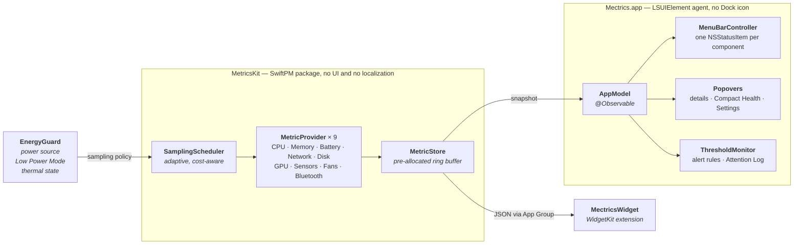

# Architecture

How mectrics is put together and why. This assumes general application experience rather
than familiarity with AppKit, IOKit, or the SMC.

## The split

The metric engine is a UI-independent Swift package. Everything that touches the machine
lives there; everything that touches the screen lives in the app target. That is what makes
the engine testable, keeps a misbehaving provider away from the UI, and lets the widget
extension read the same data.



## Technology choices

| Layer | Choice | Why |
|-------|--------|-----|
| Language | **Swift 6** (MetricsKit builds in the Swift 6 language mode) | Native, low resource use; strict concurrency checks the queue boundaries the engine crosses. |
| UI | **SwiftUI + AppKit hybrid** | SwiftUI for settings, popovers, and windows. AppKit (`NSStatusItem`) for the menu bar — pure SwiftUI `MenuBarExtra` cannot do the custom drawing a live sparkline needs. |
| Menu bar | **`NSStatusItem` + rendered `NSImage`** | Live text and sparkline, ⌘-drag reordering, pixel-precise width control. |
| Widget | **WidgetKit** extension | System-native but throttled to minutes; the menu bar covers the real-time need. |
| Metric engine | **Local Swift package `MetricsKit`** | Testable, UI-independent, shared with the widget extension. |
| Sharing | **App Group container** | Main app ↔ widget extension data hand-off. |
| Reactivity | **`@Observable`** | sampler → store → app model → UI. |
| Persistence | **UserDefaults (App Group)** + a small JSON snapshot | Settings plus the widget's last snapshot. No database needed. |
| Updates | **Sparkle** | The standard for directly distributed macOS apps. |
| Login item | **`SMAppService`** | The modern launch-at-login API. |

**Minimum target:** macOS 15 Sequoia, Apple Silicon. Modern APIs (`@Observable`, current
WidgetKit) are therefore freely usable.

## MetricsKit

```swift
// A single measurement.
struct MetricSample {
    let timestamp: Date
    let value: Double            // normalized base value (e.g. CPU load as a fraction)
    let detail: [String: Double] // per-core, used/wired, up/down, and so on
}

protocol MetricProvider: AnyObject, Sendable {
    var id: MetricID { get }         // .cpu, .memory, ...
    var isAvailable: Bool { get }    // hardware and permission present?
    var cost: SamplingCost { get }   // light / medium / heavy → scheduling weight
    func sample() -> MetricSample?
}

final class MetricStore {
    // A fixed-size ring buffer per metric, pre-allocated.
    func append(_ sample: MetricSample, for id: MetricID)
    func latest(_ id: MetricID) -> MetricSample?
    func history(_ id: MetricID, count: Int) -> [MetricSample]   // sparklines
}
```

Providers are sampled on a single serial queue, which is why `MetricProvider` requires
`Sendable` and the concrete providers are `@unchecked Sendable`: they wrap C-based
Mach/IOKit state and own their synchronization. Anything read outside that queue must be
guarded by a lock.

A provider that returns `isAvailable = false` is filtered out at registration, so its module
disappears from the UI rather than showing an empty row.

### Where the numbers come from

| Metric | Source | Pitfall |
|--------|--------|---------|
| CPU | `host_processor_info(PROCESSOR_CPU_LOAD_INFO)` | Usage is the difference between two consecutive samples; per-core comes from the same call. |
| Memory | `host_statistics64(vm_statistics64)` + `sysctl(hw.memsize)` | Pressure and compressed pages are separate from plain "used". |
| Battery | IOKit `IOPSCopyPowerSourcesInfo`; health and cycles from `IORegistry AppleSmartBattery` | Two different sources feed one module. |
| Network | `sysctl(NET_RT_IFLIST2)` + `if_data64` | Δbytes/Δt. 64-bit counters are required — 32-bit ones wrap on a long uptime. Loopback is filtered by `IFF_LOOPBACK`. |
| Disk space | `statfs` / `URL.resourceValues` | Straightforward. |
| Disk throughput | IOKit `IOBlockStorageDriver` statistics | Δ read/write bytes. |
| GPU | IOKit accelerator "Device Utilization %"; VRAM via IORegistry | Keys differ across Apple Silicon generations. |
| Temperature | SMC key reads; `IOHIDEventSystemClient` thermal sensors on Apple Silicon | The SMC key set differs per machine — treat every key as optional. |
| Fans | SMC `F*Ac` keys | Some Macs have no fans at all. |
| Bluetooth | IORegistry device `BatteryPercent` | Only devices that report a battery appear. |

All of these are read-only. Reading sensors, SMC, fans, and GPU is restricted under the App
Store sandbox, which is why full functionality requires direct distribution with a Developer
ID and notarization.

## Menu bar rendering

- One `NSStatusItem` per enabled **component**, not per module — Battery can contribute its
  icon and its health as two independent items.
- Each item renders text plus an optional sparkline into an `NSImage` assigned to the button.
  This avoids subview layout, is pixel-precise, and adapts correctly to light and dark.
- **Width stability is a hard rule.** Each component reserves a fixed text width from a
  worst-case template (`MetricStatusItem.template(for:)`) and right-aligns monospaced digits
  inside it. An item must never change width because a value gained a digit.
- Redraw follows store updates and is throttled when the item is not visible.
- ⌘-drag reordering is native; `NSStatusItem.autosaveName` preserves position.

## Compact Health

The always-on-top floating panel that once existed was removed: it duplicated the menu bar
without answering a question the menu bar could not, and it dragged along per-display
placement, a global hotkey, and two layout modes.

The optional **Compact Health** item replaced it — a single stable-width status item that
stays quiet and turns into a warning only when an alert routed to it activates. Real-time
viewing therefore lives entirely in the menu bar and its popovers, and no second
always-visible surface should be reintroduced.

## Widget

`TimelineProvider` reads the last snapshot from the App Group container. The main app
periodically writes that snapshot plus a short history and calls
`WidgetCenter.shared.reloadTimelines`. The system throttles widget refreshes to minutes, so
the widget is positioned as "at a glance" while the menu bar carries the real-time job.

## Power and performance

- **Adaptive sampling** — faster on AC, slower on battery, paused when the work is not
  visible.
- **Energy Guard** moves the engine between normal, reduced, and protected modes based on
  power source, Low Power Mode, and thermal pressure.
- Heavy providers (SMC, GPU, sensors) declare `cost = .heavy` and are sampled less often.
- The hot path is allocation-free: the ring buffer is pre-allocated.
- Targets: under 60 MB RAM, low and steady CPU, "Energy Impact: Low" in Activity Monitor.

## Privacy and distribution

- **Zero telemetry.** The only permitted network call is an explicit update check.
- Release builds use Hardened Runtime, a Developer ID signature, notarization, and stapling.
- The main app is not sandboxed — IOKit metric access requires it. The widget extension is
  sandboxed.
- Releases are produced by [`../scripts/release.sh`](../scripts/release.sh), which archives,
  signs, packages a DMG, notarizes, and staples in one pass.
- See [`../PRIVACY.md`](../PRIVACY.md) for the privacy statement.

## Testing

- `MetricsKitTests` covers computation correctness (Δbytes/Δt, CPU percentages) and store
  behaviour, including concurrent reads and writes.
- `MectricsTests` covers app-layer logic: alert rules, Energy Guard, the Attention Log,
  diagnostics export redaction, menu bar layout presets, and URL routing.
- Hardware coverage is inherently manual: fanless machines, external displays, low battery,
  and machines whose SMC key set differs.

## Repository layout

```
mectrics/
├── project.yml               # XcodeGen definition — the source of the Xcode project
├── AGENTS.md                 # conventions (source of truth for contributors)
├── docs/                     # this document and the release procedure
├── Mectrics/                 # menu bar app (SwiftUI + AppKit)
│   ├── App/                  # AppDelegate, AppModel, login item, widget snapshots
│   ├── MenuBar/              # NSStatusItem controllers + live sparkline drawing
│   ├── UI/                   # popover, sparkline, formatting, themes, localization
│   ├── Onboarding/           # three-step first-launch flow
│   ├── Alerts/               # alert rules, threshold + system condition monitors
│   ├── Attention/            # local Attention Log store and window
│   ├── Energy/               # Energy Guard sampling policy
│   ├── Diagnostics/          # local-only system summary and export
│   ├── Release/              # About, What's New, update status (Sparkle)
│   ├── Settings/             # General / Menu Bar builder / Alerts
│   └── Resources/            # Localizable.xcstrings, assets, privacy manifest
├── MectricsShared/           # types shared between app and widget
├── MectricsWidget/           # small/medium/large WidgetKit overview
├── MectricsTests/            # app-layer unit tests
├── Packages/MetricsKit/      # the metric engine (SwiftPM)
│   ├── Sources/MetricsKit/   # providers, scheduler, store, engine, sharing
│   ├── Sources/MectricsCLI/  # `swift run mectrics-cli` — terminal readout
│   └── Tests/
└── scripts/
    ├── release.sh            # archive → sign → DMG → notarize → staple
    └── generate-banner.py    # regenerates the README banner pair
```
